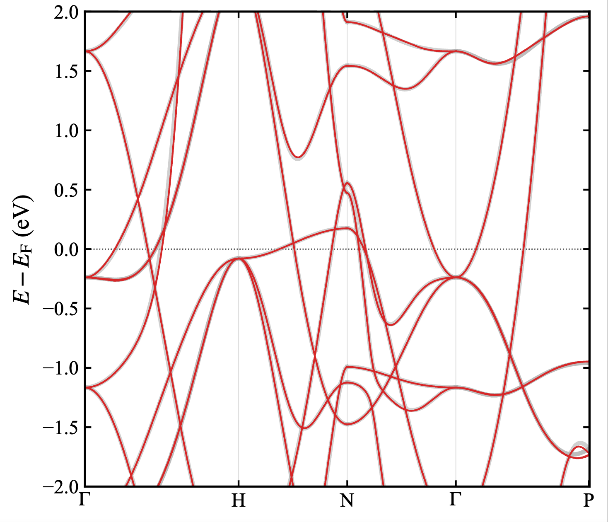
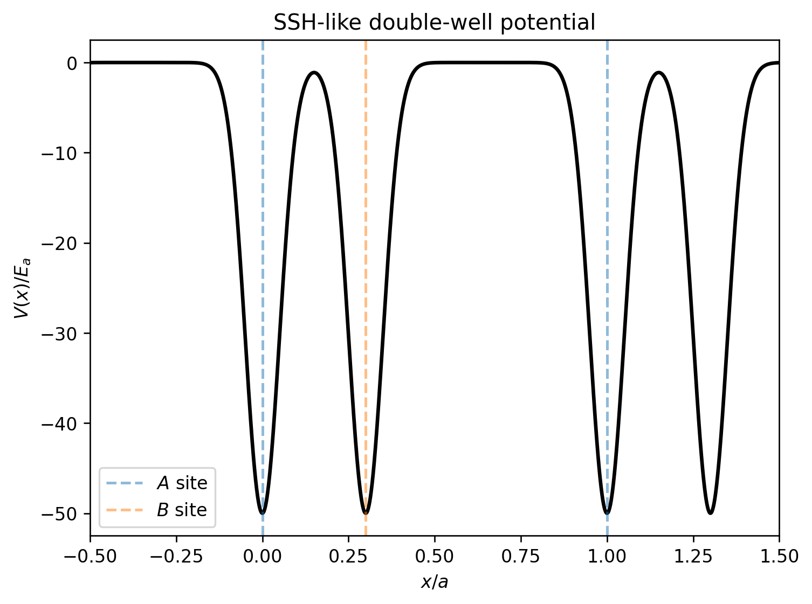
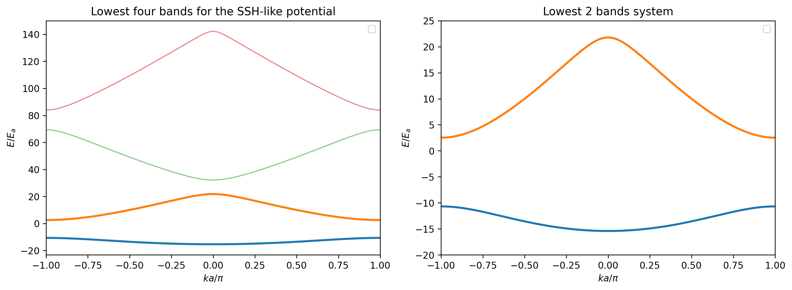
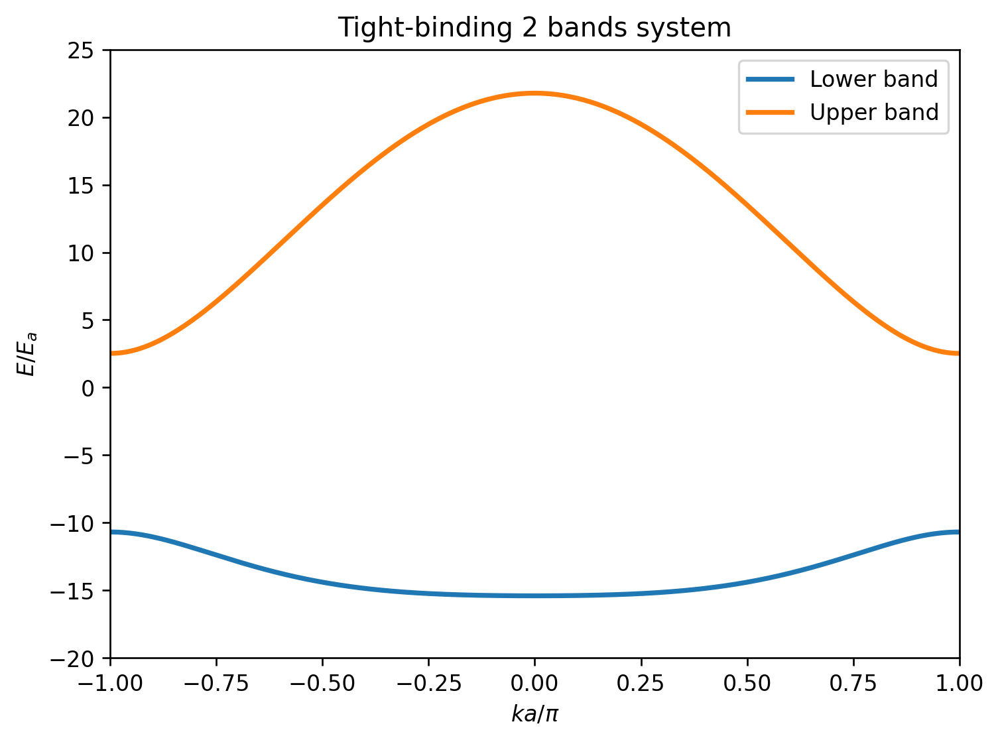

This article is a simple introduction to the Wannier function. It won't go into more technical details, but will give a general idea of what it is and what it does in the practical calculation with my own understanding and thinking framework. It's not a formal article and may contain some mistakes, feel free to contact me if you have any questions or suggestions.

# Where does it come from?

The modern condensed matter physics aims to figure out the electron structures and behaviours in the crystal-like, i.e. the periodic potential field. As a fundamental theory, Bloch's theorem tells the most important property of the wave function while it is noticed that the crystal momentum $k$ is a good quantum number in such periodic potential. [[1]](#ref-1)

$$
\begin{align}
\psi_{n\mathbf k}(\mathbf r+\mathbf R)
&=
e^{i\mathbf k\cdot\mathbf R}
\psi_{n\mathbf k}(\mathbf r).
\end{align}
$$

However, Bloch's picture describe the electron as a "running wave" in the infinite potential field, which is not naturally consistent with the "atomic" picture. Early quantum mechanics provided a clear orbital picture for isolated
atoms, most notably through the exact solution of the hydrogen atom and approximate treatments of many-electron atoms. It is simpler and more intuitive to treat the electron states in the periodic potential as the linear combination of the localized atomic-orbital-like real space functions.

Gregory Wannier gave his answer in 1937 when studying the electron-hole excitation in the crystal. He constructed the Wannier Functions (WFs) to bridge the above gap. [[2]](#ref-2)

Wannier functions are real-space representatives of a chosen Bloch-band subspace. For a finite crystal containing $N$ unit cells with periodic
boundary conditions, the Wannier states associated with an isolated band are defined by

$$
\begin{align}
\left|w_{n\mathbf R}\right\rangle
&=
\frac{1}{\sqrt{N}}
\sum_{\mathbf k}
e^{-i\mathbf k\cdot\mathbf R}
\left|\psi_{n\mathbf k}\right\rangle.
\end{align}
$$

For a composite subspace containing $J$ bands, the Bloch states at each $\mathbf k$ can also mix with each other:

$$
\begin{align}
|w_{n\mathbf R}\rangle
&=
\frac{1}{\sqrt N}
\sum_{\mathbf k}
e^{-i\mathbf k\cdot\mathbf R}
\sum_{m=1}^{J}
|\psi_{m\mathbf k}\rangle
U_{mn}(\mathbf k).
\end{align}
$$

Here $U(\mathbf k)\in U(J)$ is a $\mathbf k$-dependent unitary matrix. It represents the gauge freedom inside the selected band subspace. Different choices of $U(\mathbf k)$ keep the same subspace, but generally give different Wannier functions and different degrees of localization.

Their position-space representations are complex-valued functions:

$$
\begin{align}
w_{n\mathbf R}(\mathbf r)
&=
\left\langle\mathbf r\middle|w_{n\mathbf R}\right\rangle,
\end{align}
$$

Wannier functions have the following important properties.

- **Lattice-translation covariance**

  Wannier functions in different unit cells are related by lattice
  translations:

  $$
  \begin{align}
  
  w_{n\mathbf R}(\mathbf r)
  &=
  w_{n\mathbf 0}(\mathbf r-\mathbf R).
  \end{align}
  $$

- **Orthonormality**

  $$
  \begin{align}
  \left\langle
  w_{n\mathbf R}
  \middle|
  w_{m\mathbf R'}
  \right\rangle
  &=
  \delta_{nm}\delta_{\mathbf R\mathbf R'}
  \end{align}
  $$

- **Completeness within the selected band subspace**

  The Wannier states form an orthonormal basis for the range of a band
  projector $\hat P$:

  $$
  \begin{align}
  \mathcal H_P
  &:=
  \operatorname{Ran}\hat P
  =
  \overline{\operatorname{span}}
  \left\{
  \left|w_{n\mathbf R}\right\rangle
  \right\}_{n,\mathbf R}
  \end{align}
  $$

  The projector satisfies

  $$
  \begin{aligned}
  &\hat P^2=
  \hat P, \ 
  \hat P^\dagger
  =
  \hat P

  \\

  &\hat P
  =
  \sum_{n,\mathbf R}
  \left|w_{n\mathbf R}\right\rangle
  \left\langle w_{n\mathbf R}\right|
  \end{aligned}
  $$

- **Real-space localization**

  When a sufficiently smooth gauge exists, the Wannier functions can be
  chosen to decay rapidly away from the centers. For exponentially
  localized Wannier functions,

  $$
  \begin{align}
  \left|
  w_{n\mathbf R}(\mathbf r)
  \right|
  &\leq
  C_n
  e^{-\alpha_n
  \left|\mathbf r-\mathbf R\right|},
  \qquad
  C_n,\alpha_n>0.
  \end{align}
  $$

Therefore, Wannier functions do not satisfy the Bloch
condition. For an isolated band, the Bloch state is obtained as a momentum-labelled
superposition of Wannier functions distributed over all lattice cells:
$$
\begin{align}
\left|\psi_{n\mathbf k}\right\rangle
&=
\frac{1}{\sqrt N}
\sum_{\mathbf R}
e^{i\mathbf k\cdot\mathbf R}
\left|w_{n\mathbf R}\right\rangle.
\end{align}
$$

For composite bands, the inverse transformation instead reconstructs a Bloch-like state in the Wannier gauge,

$$
\begin{align}
\left|\widetilde\psi_{n\mathbf k}\right\rangle
&=
\sum_{m=1}^{J}
\left|\psi_{m\mathbf k}\right\rangle
U_{mn}(\mathbf k)
\notag
\\
&=
\frac{1}{\sqrt N}
\sum_{\mathbf R}
e^{i\mathbf k\cdot\mathbf R}
\left|w_{n\mathbf R}\right\rangle.
\end{align}
$$

The two representations, the Bloch $\ket{\psi_{n\mathbf k}}$ and the Wannier $\ket{w_{n\mathbf R}}$ both describe the correct band dispersion. Bloch
states are extended throughout the
crystal, whereas Wannier states sacrifice a definite momentum label in
exchange for real-space localization.

# What does it do?

In the condensed matter calculation, Wannierization is most
commonly used as a post-processing step following a first-principles electronic structure calculation, mostly Density Functional Theory (DFT), even though it is not the initial purpose of Wannier's original work. 

In 1997, Marzari and Vanderbilt introduced the maximally localized Wannier functions (MLWFs) for composite bands [[3]](#ref-3). In 2001, Souza, Marzari, and Vanderbilt extended this method to entangled bands through a disentanglement procedure [[4]](#ref-4). In 2008, the `Wannier90` package was published [[5]](#ref-5).

Wannier90 does not determine the electronic structure by itself. Instead, it takes the eigenvalues, Bloch-state overlaps, and trial-orbital projections supplied by a first-principles calculation and constructs a localized representation of a selected band subspace. Within a fixed isolated subspace, Wannierization is a unitary change of basis. Approximations enter when an effective subspace is disentangled and when long-ranged real-space matrix entries are truncated. 

In a first-principles workflow, DFT supplies the Kohn-Sham Hamiltonian, eigenvalues, and Bloch eigenstates:

$$
\begin{align}
\hat H_{\mathrm{KS}}[\rho]
\left|\psi_{n\mathbf k}\right\rangle
&=
\varepsilon_{n\mathbf k}
\left|\psi_{n\mathbf k}\right\rangle.
\end{align}
$$

Wannierization gives the Real Space Hamiltonian under the Real Space Wannier basis
$$
\begin{align}
H_{mn}(\mathbf R) = \bra{w_{m\mathbf 0}}\hat{H}\ket{w_{n\mathbf R}}
\end{align}
$$
And the Fourier transformation to momentum reciprocal space
$$
\begin{align}
H_{mn}(\mathbf k)
&=
\sum_{\mathbf R}
e^{i\mathbf k\cdot\mathbf R}
H_{mn}(\mathbf R).
\end{align}
$$

**So why do we wannierize it instead of using the original DFT result directly?**

First-principles DFT calculations provide an accurate description of the electronic structure. In principle, most physical
quantities can be evaluated directly from the
Kohn-Sham eigenstates. In practice, the difficulty lies in
repeating such calculations over the extremely dense momentum meshes
required for Brillouin-zone integration. Such large plane-wave diagonalizations on the mesh is too expensive to be practical, especially for large systems. 

Wannierization replaces large-scale calculation with a
compact interpolation problem. 
Dense-mesh calculations require only the diagonalization
of a much smaller Wannier Hamiltonian. Topological invariants,
Berry curvature, transport coefficients, and dynamical response
functions can therefore be evaluated efficiently without 
solving the original large plane-wave problem.

For example, the primitive bcc Fe unit cell contains only 1 magnetic atom, but the DFT calculation requires more than 600 plane waves to converge the Kohn-Sham eigenstates. In contrast, a Wannier Hamiltonian with 18 basis functions per unit cell is sufficient to reproduce the correct band structure over a wide energy range centered on the Fermi level. The Wannier Hamiltonian is therefore more than an order of magnitude smaller than the original DFT Hamiltonian, and its diagonalization is correspondingly faster.

##  1-dimensional ssh-like example

Suppose we have a 1-dimensional SSH-like model with two identical atoms in a unit cell.

- lattice constant $a$
- relative position $d$

The potential is given by
$$
\begin{align}
V(x)
&=
-V_0 \sum_{R\in \Lambda} [g(x-R) + g(x-R-d)]
\end{align}
$$

where $g(x)$ is the Gaussian function defined as
$$
\begin{align}
g(x)
&=
e^{-\frac{x^2}{2\sigma^2}}.
\end{align}
$$
and the lattice set $\Lambda$ is defined as
$$
\begin{align}
\Lambda
&=
\{ma| m\in \mathbb Z\}.
\end{align}
$$

### Plane wave solution
The Hamiltonian is given by
$$
\begin{align}
\hat H
&=
-\frac{\hbar^2}{2m}\frac{d^2}{dx^2}
+
V(x)
\end{align}
$$

from the Bloch theorem, the Bloch wave function is the eigenfunction of the Hamiltonian.
$$
\begin{align}
\psi_{n k}(x) = e^{ikx}u_{nk}(x) 
\end{align}
$$

expand the periodic function $u_{nk}(x)$
$$
\begin{align}
\psi_{nk}(x)
&=
\sum_G
C_{nG}(k)e^{i(k+G)x}.
\end{align}
$$

We can define the normalized plane wave basis in the real space as
$$
\begin{align}
\braket{x|k+G}
&=
\frac{1}{\sqrt L}e^{i(k+G)x}.
\end{align}
$$

Then we have the Bloch states in the plane wave basis as
$$
\begin{align}
\ket{\psi_{nk}}
&=
\sum_G
C_{nG}(k)\ket{k+G}.
\end{align}
$$

Then the eigenvalue problem can be written as
$$
\begin{align}
\sum_{G'}\bra{k+G}\hat H\ket{k+G'}C_{nG'}(k)
&=
E_{nk}C_{nG}(k).
\end{align}
$$

#### Kinetic energy
$$
\begin{align}
\bra{k+G}\hat T\ket{k+G'}
&=
\frac{\hbar^2}{2m}(k+G)^2\delta_{GG'}
\end{align}
$$
which is the diagonal term

#### Potential energy
$$
\begin{align}
\bra{k+G}\hat V\ket{k+G'}
&=
V_{G-G'}
\end{align}
$$

In order to find the off-diagonal term, we can use the Fourier transformation to get the potential in the reciprocal space
$$
\begin{align}
V_G
&=
\frac{1}{a}\int_0^a  V(x)e^{-iGx} dx
\end{align} 
$$
$$
\begin{aligned}
V_G=
-\frac{V_0}{a}\sum_{R\in \Lambda} \int_0^a [g(x-R) + g(x-R-d)] e^{-iGx} dx
\end{aligned}
$$
here we only show the contribution from the first term, the second term is similar

$$
\begin{aligned}
V_G^{(1)}
&=
-\frac{V_0}{a}\int_0^a \sum_{R\in \Lambda}  g(x-R) e^{-iGx} dx
\\
&=
-\frac{V_0}{a} \sum_{m \in \mathbb{Z}} \int_{0}^{a}  e^{-\frac{(x-ma)^2}{2\sigma^2}} e^{-iGx} dx
\\
&=
-\frac{V_0}{a}  \sum_{m \in \mathbb{Z}} \int_{-ma}^{a-ma}  e^{-\frac{x^2}{2\sigma^2}} e^{-iG(x+m a)} dx
\\
\end{aligned}
$$

$m$ enumerates all the integers
$$
e^{-iGma} = e^{-i\frac{2\pi}{a}jm a} = 1
$$

$$
V_G^{(1)}
=
-\frac{V_0}{a}  \int_{-\infty}^{\infty} e^{-\frac{x^2}{2\sigma^2}} e^{-iGx} dx
=
-\frac{V_0}{a} \sqrt{2\pi}\sigma e^{-\frac{G^2\sigma^2}{2}}
$$

The second term is similar, we can get the final result
$$
\begin{align}
V_G
&=
-\frac{V_0}{a} \sqrt{2\pi}\sigma e^{-\frac{G^2\sigma^2}{2}}(1+e^{-iGd})
\end{align}
$$
so the potential entry is
$$
\begin{align}
V_{G-G'}
&=
-\frac{V_0}{a} \sqrt{2\pi}\sigma e^{-\frac{(G-G')^2\sigma^2}{2}}(1+e^{-i(G-G')d})
\end{align}
$$
with the Hamiltonian entry
$$
\begin{align}
\bra{k+G}\hat H\ket{k+G'}
&=
-\frac{V_0}{a} \sqrt{2\pi}\sigma e^{-\frac{(G-G')^2\sigma^2}{2}}(1+e^{-i(G-G')d}) + \frac{\hbar^2}{2m}(k+G)^2\delta_{GG'}
\end{align}
$$
we can construct the Hamiltonian matrix and diagonalize it at any given $k$ point to get the band structure. We take total 111 dimension with $G = -55\frac{2\pi}{a}, -54\frac{2\pi}{a}, \cdots, 55\frac{2\pi}{a}$, the proper parameters are selected. We get the lowest band structure as shown in the figure below. 

### Tight-binding approximation

In practical calculation, we only care about the specific bands of the system, which is usually near the Fermi surface, or with nontrivial topological structures by selecting an energy window to construct a subspace. The lowest two plane-wave bands are separated from the higher-energy bands by a finite gap and therefore form a well-defined two-dimensional invariant subspace. We would like to describe this subspace using two localized orbitals per unit cell. 

Suppose we have 2 orbitals in the 2 positions of the unit cell as $\ket{A, R}$ and $\ket{B, R}$, we can write Hopping term

- Onsite
    $$
    \begin{align}
    \bra{A, R}\hat H\ket{A, R}
    &=
    \bra{B, R}\hat H\ket{B, R}
    =
    \epsilon_0
    \end{align}
    $$
- Inter-cell same site
    $$
    \begin{align}
    \bra{A, R}\hat H\ket{A, R+a}
    &=
    \bra{B, R}\hat H\ket{B, R+a}
    =
    t_0
    \end{align}
    $$
- Intra-cell 
    $$
    \begin{align}
    \bra{A, R}\hat H\ket{B, R}
    &=
    t_1
    \end{align}
    $$
- Inter-cell different site
    $$
    \begin{align}
    \bra{A, R+a}\hat H\ket{B, R}
    &=
    t_2
    \end{align}
    $$

Second quantization form

$$
\begin{align}
\hat H_{\mathrm{ext}}
={}&
\sum_R
\epsilon_0
\left(
\hat c_{A,R}^\dagger\hat c_{A,R}
+
\hat c_{B,R}^\dagger\hat c_{B,R}
\right)
+
\sum_R
\left[
t_0
\left(
\hat c_{A,R+a}^\dagger\hat c_{A,R}
+
\hat c_{B,R+a}^\dagger\hat c_{B,R}
\right)
+\mathrm{h.c.}
\right]
\notag
\\
&+
\sum_R
\left[
t_1\hat c_{A,R}^\dagger\hat c_{B,R}
+
t_2\hat c_{A,R+a}^\dagger\hat c_{B,R}
+
\mathrm{h.c.}
\right].
\end{align}
$$

Fourier transforming the annihilation and creation operators
$$
\begin{align}
\hat c_{A,R}
&=
\frac{1}{\sqrt N}
\sum_k
e^{ikR}
\hat c_{A,k} \notag
\\
\hat c_{B,R}
&=
\frac{1}{\sqrt N}
\sum_k
e^{ikR}
\hat c_{B,k}
\end{align}
$$
We can write the Hamiltonian in the momentum space by
$$
\begin{align}
\hat H = \sum_k \Psi_k^\dagger H(k) \Psi_k
\end{align}
$$
where $\Psi_k = [\hat c_{A,k}, \hat c_{B,k}]^T$ and the Hamiltonian matrix is
$$
\begin{align}
H(k)
&=
\begin{bmatrix}
\epsilon_0 + 2t_0\cos(ka) & t_1 + t_2 e^{-ika} \\
t_1 + t_2 e^{ika} & \epsilon_0 + 2t_0\cos(ka)
\end{bmatrix}
\end{align}
$$
($\epsilon_0, t_0, t_1, t_2 \in \mathbb{R}$)

With the proper parameters, we can get the band structure as shown below. 

### Where Wannier Enters

The two calculations above reveal the trade-off between the plane-wave
and tight-binding descriptions. The plane-wave method solves the
continuum Hamiltonian in a large and delocalized basis. However, the resulting Hamiltonian is large and its
real-space interpretation is not immediately transparent.

The extended SSH model takes the opposite approach. It assumes two
localized orbitals, $\ket{A,R}$ and $\ket{B,R}$, and retains only a small
number of hopping parameters. The resulting $2\times2$ Hamiltonian is
simple and physically intuitive. However,
the model itself does not tell us what the two orbital wave functions
actually are, nor does it determine the values of
$\epsilon_0,t_0,t_1,$ and $t_2$. In the example above, these parameters
were fitted manually to the plane-wave band structure.

Wannierization provides the missing connection between these two
descriptions. Starting from the isolated two-band subspace obtained in
the plane-wave calculation, it constructs two localized Wannier
functions per unit cell. In the MLWF method,
the gauge freedom of the Bloch states is chosen by minimizing the
real-space spread of these functions. The states $\ket{A,R}$ and
$\ket{B,R}$ in the tight-binding model can therefore be replaced by
explicitly constructed Wannier functions rather than assumed atomic-like
orbitals.

Once the Wannier basis has been constructed, the original Hamiltonian is
represented by the real-space matrix elements as shown in Eq. (12). 

The onsite energies and hopping parameters are then identified from
these matrix elements. For example,

$$
\begin{align}
\epsilon_0
&\sim H_{11}(0),
&
t_1
&\sim H_{12}(0), \notag
\\
t_0
&\sim H_{11}(a),
&
t_2
&\sim H_{12}(-a).
\end{align}
$$

Unlike the SSH model above, the Wannier Hamiltonian also reveals
longer-ranged hopping processes whenever their matrix elements are
non-negligible. A practical tight-binding model is obtained by choosing
a real-space cutoff and retaining the relevant matrix elements:

$$
\begin{align}
H_{mn}(k)
&=
\sum_{R \in \text{cutoff set}}
e^{ik \cdot R}
H_{mn}(R).
\end{align}
$$

Wannierization does more than provide another tight-binding
model. It systematically derives the localized basis and its hopping
parameters from the original plane-wave calculation, while allowing the accuracy
and complexity of the effective model to be controlled through the
real-space cutoff. With the real-space Wannier Hamiltonian, position operator, and other physical operators represented in the Wannier basis, we gain efficient access to these physical quantities. **Wannierization does not change the physics; it changes the language in which the physics becomes transparent.**

References:

1. F. Bloch, “Über die Quantenmechanik der Elektronen in Kristallgittern,” *Z. Phys.* **52**, 555–600 (1929), [doi:10.1007/BF01339455](https://doi.org/10.1007/BF01339455).

2. G. H. Wannier, “The Structure of Electronic Excitation Levels in Insulating Crystals,” *Phys. Rev.* **52**, 191–197 (1937), [doi:10.1103/PhysRev.52.191](https://doi.org/10.1103/PhysRev.52.191).

3. N. Marzari and D. Vanderbilt, “Maximally Localized Generalized Wannier Functions for Composite Energy Bands,” *Phys. Rev. B* **56**, 12847–12865 (1997), [doi:10.1103/PhysRevB.56.12847](https://doi.org/10.1103/PhysRevB.56.12847).

4. I. Souza, N. Marzari, and D. Vanderbilt, “Maximally Localized Wannier Functions for Entangled Energy Bands,” *Phys. Rev. B* **65**, 035109 (2001), [doi:10.1103/PhysRevB.65.035109](https://doi.org/10.1103/PhysRevB.65.035109).

5. A. A. Mostofi *et al.*, “wannier90: A Tool for Obtaining Maximally-Localised Wannier Functions,” *Comput. Phys. Commun.* **178**, 685–699 (2008), [doi:10.1016/j.cpc.2007.11.016](https://doi.org/10.1016/j.cpc.2007.11.016).

6. N. Marzari *et al.*, “Maximally Localized Wannier Functions: Theory and Applications,” *Rev. Mod. Phys.* **84**, 1419–1475 (2012), [doi:10.1103/RevModPhys.84.1419](https://doi.org/10.1103/RevModPhys.84.1419).

